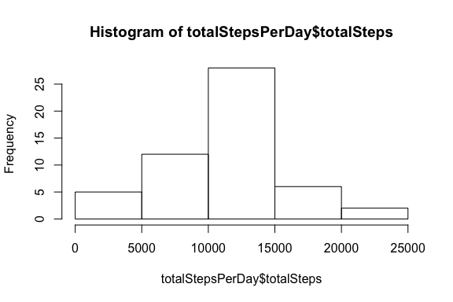

# Reproducible Research: Peer Assessment 1

##Setting global options and loading libraries

I want to avoid code warnings e.g. for the version of a library being a bit old.


```r
knitr::opts_chunk$set( echo = TRUE, results = "asis", warning=FALSE, message=FALSE, fig.width=6, fig.height=4, fig.path='Figs/')

library(dplyr)
library(lattice)
library(ggplot2)
library(xtable)
library(pander)

panderOptions('digits', 2)
panderOptions('round', 2)
```

## Loading and preprocessing the data

Unzip data file if necessary

```r
dataFile <- "activity.csv"
zipFile <- "activity.zip"
if(!file.exists(dataFile)) {
    unzip(zipFile)
}
```

Load the data


```r
class <- c("numeric", "Date", "numeric")
data <- read.csv(dataFile, colClasses = class)
```
Since the type of the date is forced to Date, no further transformation is necessary.

## What is mean total number of steps taken per day?

Calculate the total number of steps taken per day


```r
totalStepsPerDay <- data %>%
    select(date, steps) %>%
    filter(!is.na(steps)) %>%
    group_by(date) %>%
    summarize(totalSteps = sum(steps, na.rm = TRUE))
```

Make a histogram of the total number of steps taken each day


```r
hist(totalStepsPerDay$totalSteps)
```

<!-- -->

The default histogram is nor detailed enough; let's set the number of buckets, and point out the mean (magenta) and the median (cyan).


```r
hist(totalStepsPerDay$totalSteps, breaks=20)
abline(v=mean(totalStepsPerDay$totalSteps), col="magenta", lwd=4)
abline(v=median(totalStepsPerDay$totalSteps), col="cyan", lwd=4)
```

<!-- -->

Calculate and report the mean and median of the total number of steps taken per day


```r
stepsMean <- mean(totalStepsPerDay$totalSteps, na.rm=TRUE)
stepsMedian <- median(totalStepsPerDay$totalSteps, na.rm=TRUE)
```

Results: mean = _10766_; median = _10765_.

The data has a remarcably normal distribution (probably it's simulation data), with mean and median having almost the same value.

## What is the average daily activity pattern?

Make a time series plot (i.e. 𝚝𝚢𝚙𝚎 = "𝚕") of the 5-minute interval (x-axis) and the average number of steps taken, averaged across all days (y-axis)


```r
avgStepsPerInterval <- data %>%
    select(interval, steps) %>%
    group_by(interval) %>%
    summarize(avgSteps = mean(steps, na.rm = TRUE))
plot(avgStepsPerInterval$interval, avgStepsPerInterval$avgSteps, type = "l")
```

<!-- -->

Which 5-minute interval, on average across all the days in the dataset, contains the maximum number of steps?


```r
orderedStepsPerInterval <- arrange(avgStepsPerInterval, desc(avgSteps))
mostStepsInterval <- orderedStepsPerInterval[1,]
```

Interval and average number of steps: 835, 206.1698113.

## Imputing missing values

Calculate and report the total number of missing values in the dataset (i.e. the total number of rows with NAs)


```r
missingEntriesCount <- sum(is.na(data$steps))
```

Missing: 2304.

Let's look at the distribution of missing data


```r
missingPerInterval <- data %>%
    select(interval, steps) %>%
    group_by(interval) %>%
    summarize(missCount = sum(is.na(steps)))

table(missingPerInterval$missCount)
```


  8 
288 

Wow, there is something regular in the missing data: there are 12 intervals per hour and 24 hours per day, so 12*24=288 distinct intervals per day. The data suggests that all 288 intervals may have missing data for 8 days.

To check that' let's aggregate per day:


```r
missingPerDay <- data %>%
    select(date, steps) %>%
    group_by(date) %>%
    summarize(missCount = sum(is.na(steps)))

tb <- table(missingPerDay$missCount)
xtb <- xtable(tb)
print(xtb, type="html")
```

<!-- html table generated in R 3.2.2 by xtable 1.8-2 package -->
<!-- Sun Sep 25 21:20:55 2016 -->
<table border=1>
<tr> <th>  </th> <th> V1 </th>  </tr>
  <tr> <td align="right"> 0 </td> <td align="right">  53 </td> </tr>
  <tr> <td align="right"> 288 </td> <td align="right">   8 </td> </tr>
   </table>

Yes, 53 days have 0 missing entries, and 8 days have missing all 288 entries.

Let's devise a strategy for filling in all of the missing values in the dataset. From the time series graph, one can see a certain pattern: almost no steps during the night (when most people sleep), then a spike between 8-9 a.m., when people go to work, then moderate numbers during the day, and a drop in the evening.

Therefore, a suitable strategy is to use the means for the 5-min intervals for filling missing numbers.


```r
mergedData <- merge(data, avgStepsPerInterval, by = "interval")
```

Create a new dataset that is equal to the original dataset but with the missing data filled in.


```r
fixedData <- mergedData %>%
    mutate(steps = ifelse(is.na(steps), avgSteps, steps)) %>%
    select(steps, date, interval) %>%
    arrange(date, interval)
```

Make a histogram of the total number of steps taken each day and calculate and report the mean and median total number of steps taken per day.


```r
totalComputedStepsPerDay <- fixedData %>%
    select(date, steps) %>%
    group_by(date) %>%
    summarize(totalSteps = sum(steps))
    
hist(totalComputedStepsPerDay$totalSteps, breaks=20)
abline(v=mean(totalComputedStepsPerDay$totalSteps), col="magenta", lwd=4)
abline(v=median(totalComputedStepsPerDay$totalSteps), col="cyan", lwd=4)
```

<!-- -->


```r
fixedMean <- mean(totalComputedStepsPerDay$totalSteps)
fixedMedian <- median(totalComputedStepsPerDay$totalSteps)
```

Results: mean = _10766_; median = _10766_.

Obviously, there are no significant differences - given that we replaced missing data with average number of steps per interval, the averages will stay the same.

## Are there differences in activity patterns between weekdays and weekends?


```r
extendedData <- fixedData %>%
    mutate(typeOfDay = ifelse(grepl("S(at|un)", weekdays(date)), "weekend", "weekday"))

tbl <- table(extendedData$typeOfDay)
xtbl <- xtable(tbl)
print(xtbl, type="html")
```

<!-- html table generated in R 3.2.2 by xtable 1.8-2 package -->
<!-- Sun Sep 25 21:20:55 2016 -->
<table border=1>
<tr> <th>  </th> <th> V1 </th>  </tr>
  <tr> <td align="right"> weekday </td> <td align="right"> 12960 </td> </tr>
  <tr> <td align="right"> weekend </td> <td align="right"> 4608 </td> </tr>
   </table>

Let's compare the histograms for weekdays and week-end:

```r
par(mfrow=c(2, 1), mar=c(4, 4, 2, 1))
hist(subset(extendedData, typeOfDay="weekday")$steps, col="blue")
hist(subset(extendedData, typeOfDay="weekend")$steps, col="green")
```

<!-- -->

```r
par(mfrow=c(1, 1))
```
Not obvious differences, especially given the fact that the low values (no steps during the night) are overwhelming other values.

Let's compare the interval time-series.


```r
xyplot(steps ~ interval | typeOfDay, data = extendedData, layout=c(1, 2))
```

<!-- -->

```r
qplot(interval, steps, data = extendedData, facets = typeOfDay ~ .)
```

<!-- -->

The difference in activity patterns is pretty obvious, and easy to explain: during week-days, there are a significant number of steps starting after 5 am, with a peak at around 8:35 am. At the week-end, significant activity starts 2-3 hours later, and it peaks in the afternoon.
